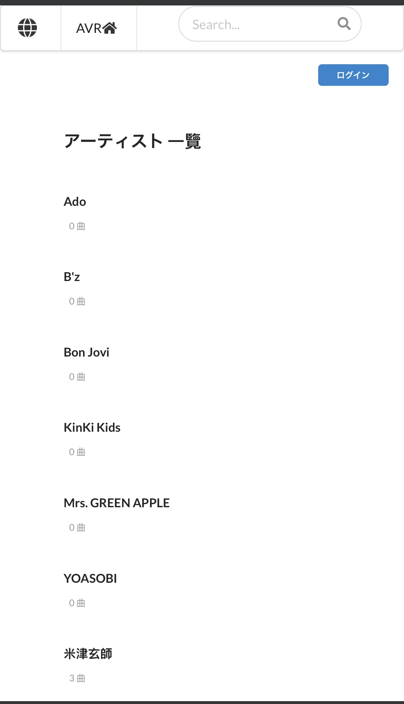
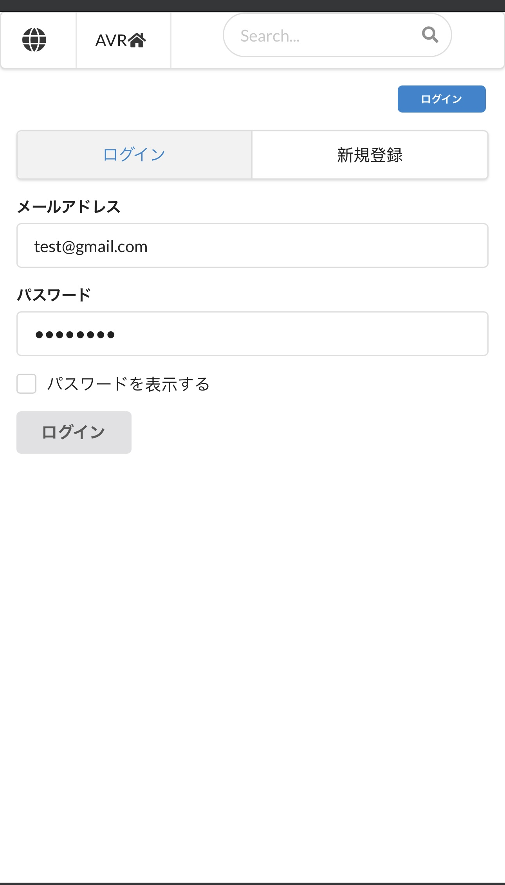
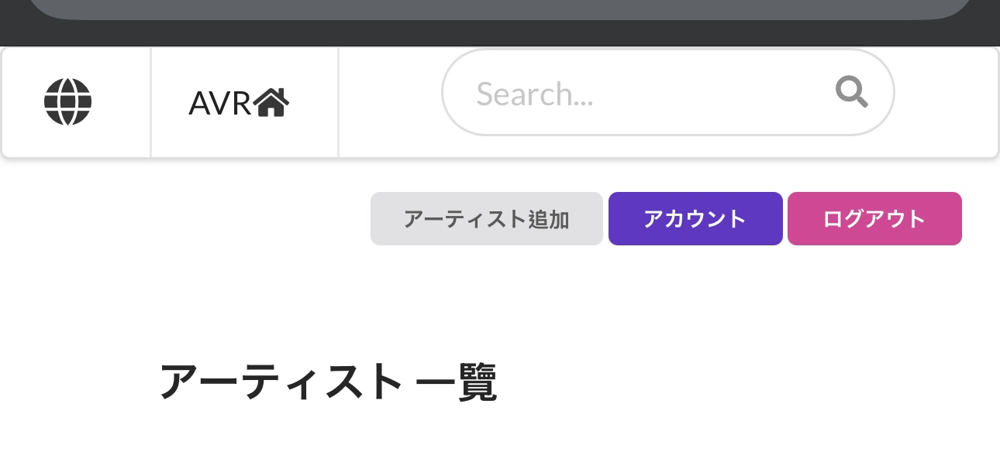
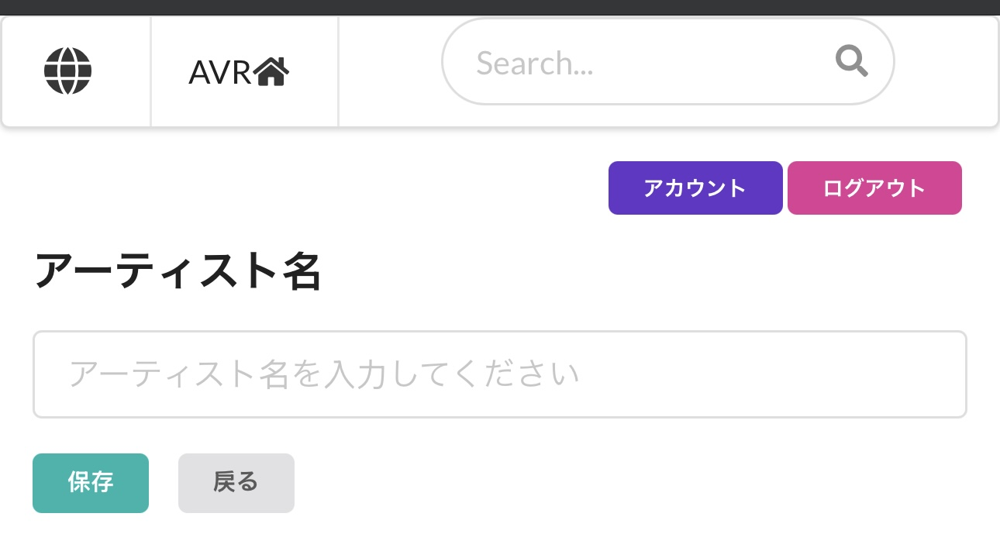
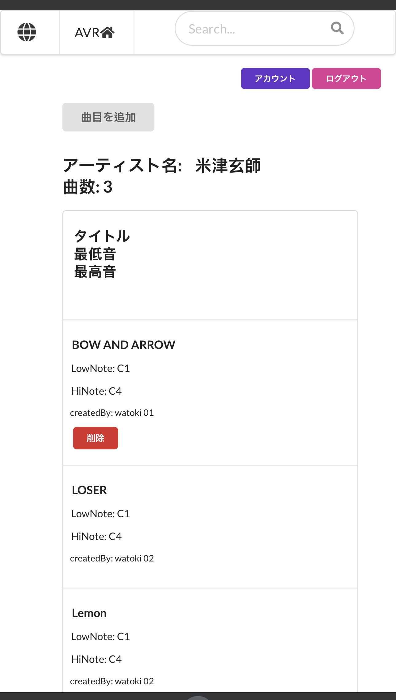
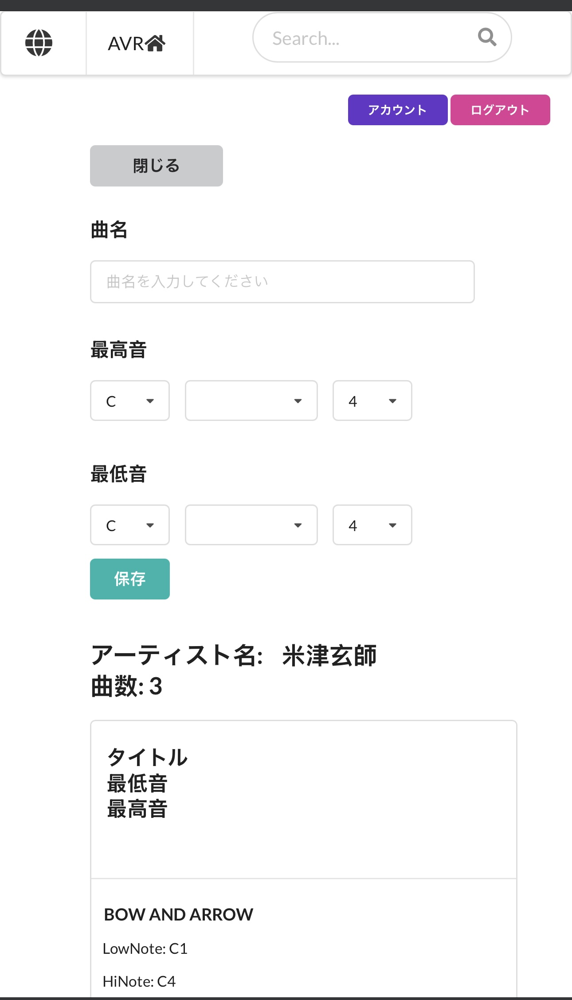
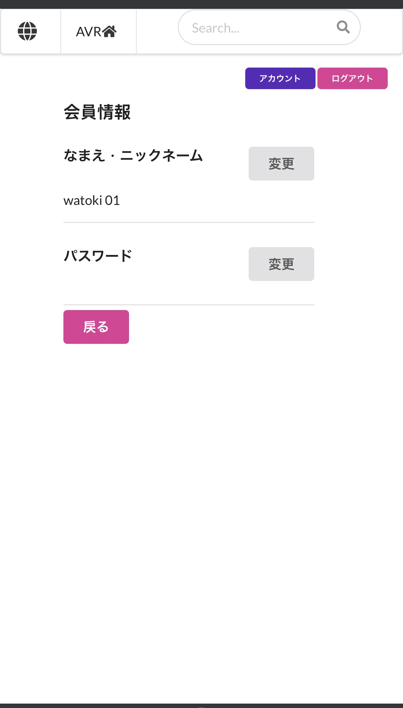
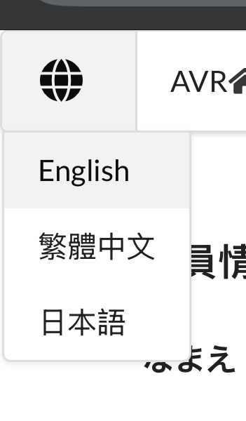
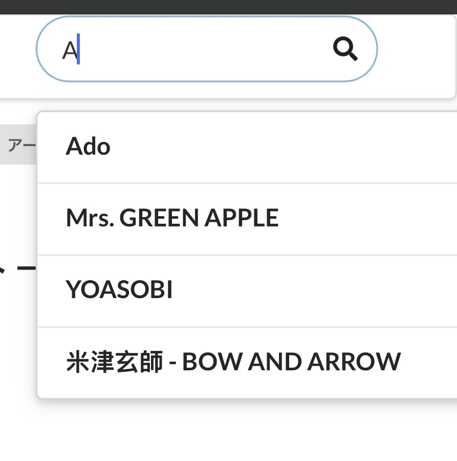

# Artist Vocal Range ver01  
  
https://artist-vocal-range.web.app/jp
  
  
日本語  
  
Artist Vocal Range (AVR) – 楽曲の音域を探求しよう！  
AVR は、楽曲の 最高音と最低音 を記録するオープンな音楽データベースです。  
シンプルで直感的な操作性を備え、ユーザーは簡単に 検索、編集、データ追加 が可能。  
日本語・英語・中国語 に対応し、PC・タブレット・スマートフォン など、  
あらゆるデバイスで快適に利用できます。  

主な機能  
✅ マルチデバイス対応：スマホ、タブレット、PC どこでも快適に操作可能  
✅ 多言語サポート：日本語・英語・中国語 で世界中のユーザーと共有  
✅ 強力な検索機能：アーティスト名・楽曲名 から簡単検索  
✅ オープン編集：Wikipedia のように誰でも楽曲の音域情報を追加・編集可能  
✅ 簡単データ追加：シンプルなUIで、アーティストや楽曲情報 をスムーズに登録  
✅ 編集セキュリティ：編集権限の設定 により、誤った削除や改変を防止  
  
近日アップデート予定  
🔹 既存の楽曲データを追加（100組以上のアーティスト を目標）  
🔹 Firebase 無料プラン対策として、自動バックアップ機能を開発  
🔹 初心者向けのガイドを追加し、使いやすさ向上  
  
今後の開発予定  
🚀 ユーザープロフィール機能 を拡充し、編集者の情報を表示可能に  
🚀 UIをアップグレード し、まるで Instagram のようなスムーズな操作性を実現  
🚀 コミュニティ機能 を追加し、音楽好き同士の交流を促進  
🚀 自分の音域を記録・活用 できるパーソナル機能を搭載  
🚀 対応言語をさらに拡充し、多くの国のユーザーが参加可能に  
  
AVR で、音楽の限界を一緒に探求しよう！ 🎵🔥  

設定方法:  
  
Firebaseの初期化  
1 Firebaseにアカウントを登録  
2 プロジェクトを追加  
3 アプリケーションを追加し、ウェブを選択  
4 Authentication > メールアドレス/パスワードを追加  
5 Firestore Databaseを追加 > 地域(自分に最も近い場所を選択) > テストモードで開始  
  
Reactの初期化設定  
1 このプロジェクトをデスクトップにダウンロードして解凍  
2 Node.jsのバージョンは20.18.2  
3 ターミナルで npm install を実行  
4 Firebaseプロジェクト設定 > SDK設定 > APIキー情報を .env ファイルに保存  
5 ターミナルで npm start を実行すると、ローカルでプロジェクトが開きます。 初期化完了  
  
Firebase Hostingの初期化  
1 FirebaseでHostingを追加  
2 ターミナルで npm install -g firebase-tools を実行  
3 ターミナルで firebase login を実行  
4 ターミナルで firebase init を実行 > Hosting: Firebase Hostingの設定ファイルを構成し、（オプションで）GitHub Actionのデプロイを設定 > スペースバーで選択 > Enterを押す > 「What do you want to use as your public directory?」の質問で build を入力 > 「Configure as a single-page app (rewrite all urls to /index.html)?」で y を入力 > 「Set up automatic builds and deploys with GitHub?」で n を入力  
5 ターミナルで firebase use --add を実行 > 「Which project do you want to add?」の質問でFirebaseのプロジェクト名を選択 > 「What alias do you want to use for this project?」で新しい名前を入力  
6 ターミナルで npm run build を実行  
7 ターミナルで firebase deploy を実行 初期化完了  

  
---

https://artist-vocal-range.web.app/en
  
English  
  
Artist Vocal Range (AVR) – Discover the Vocal Limits of Every Song!  
AVR is an open music database dedicated to recording the highest and  
lowest notes of each song's vocalist. With a simple and intuitive interface,  
users can easily search, edit, and contribute to the database.  
AVR supports English, Japanese, and Chinese, and is fully optimized for PCs, tablets,  
and smartphones, ensuring a seamless user experience across all devices.  
  
Key Features  
✅ Cross-Device Support – Smooth operation on mobile, tablet, and desktop  
✅ Multilingual Interface – Available in English, Japanese, and Chinese for global accessibility  
✅ Powerful Search – Quickly find artists and song titles  
✅ Open Editing System – Similar to Wikipedia, allowing users to freely add and update vocal range data  
✅ Easy Contribution – Effortlessly add new artists and song details  
✅ Secure Editing Mechanism – User restrictions help prevent accidental deletions or misinformation  
  
Upcoming Updates  
🔹 Uploading existing vocal range data (100+ artists planned)  
🔹 Developing an automated backup system to compensate for Firebase free plan limitations  
🔹 Adding a user guide to improve accessibility for new users  
  
Future Development Plans  
🚀 Enhanced user profiles to showcase contributors' information  
🚀 UI overhaul to provide a smooth Instagram-like experience  
🚀 Community interaction features to connect music enthusiasts  
🚀 Personal vocal range tracking for singers and musicians  
🚀 Expanding language support to welcome a global audience  
  
Join AVR and explore the boundaries of music together! 🎵🔥  
  

  Setup Instructions:  

Firebase Initialization  
1 Register an account on Firebase  
2 Add a project  
3 Add an application, choose the web option  
4 Add Authentication > Email/Password  
5 Add Firestore Database > Location (choose the nearest one) > Start in test mode  
  
React Initialization Setup  
1 Download the project to the desktop and unzip it  
2 Node.js version should be 20.18.2  
3 Run npm install in the terminal  
4 Set up Firebase project > SDK setup > Store the API key in the .env file  
5 Run npm start in the terminal to open the project locally. Initialization is complete  
  
Firebase Hosting Initialization  
1 Add Hosting in Firebase  
2 Run npm install -g firebase-tools in the terminal  
3 Run firebase login in the terminal  
4 Run firebase init in the terminal > Choose Hosting: Configure files for Firebase Hosting and (optionally) set up GitHub Action deploys > Press spacebar to select > Press enter > When asked "What do you want to use as your public directory?" input build > When asked "Configure as a single-page app (rewrite all urls to /index.html)?" input y > When asked "Set up automatic builds and deploys with GitHub?" input n  
5 Run firebase use --add in the terminal > When asked "Which project do you want to add?" select your Firebase project name > When asked "What alias do you want to use for this project?" input a new name  
6 Run npm run build in the terminal  
7 Run firebase deploy in the terminal to complete the initialization  

  
---
  
https://artist-vocal-range.web.app/zh
  
繁體中文  
  
Artist Vocal Range (AVR) – 探索每首歌曲的極限音域！  
AVR 是一個專注於記錄歌曲主唱最高音與最低音的開放式音樂資料庫。  
提供簡單直覺的操作介面，  
讓使用者輕鬆查詢、編輯與貢獻音樂資訊。  
AVR 支援 中、英、日 多語言，  
並兼容電腦、平板、手機，確保最佳使用體驗。  
  
核心功能  
✅ 跨裝置支援：無論是手機、平板還是電腦，皆可流暢使用。  
✅ 多語言環境：提供 中、英、日 界面，讓全球用戶輕鬆參與。  
✅ 強大搜尋：可快速查找 藝人名稱或歌曲，方便瀏覽與比較。  
✅ 開放編輯：類似 維基百科，用戶可自由新增、更新音域數據。  
✅ 快速貢獻：簡單直覺的操作，讓你迅速新增 藝人 與 歌曲資訊。  
✅ 安全編輯機制：設有 編輯門檻，避免惡意刪改或錯誤修改。  
  
近期更新計畫  
🔹 上傳已登記歌曲（目標 100+ 組藝術家）  
🔹 開發自動化備份機制（因應 Firebase 免費方案限制）  
🔹 新增使用者導覽，讓新手更快上手  
  
未來發展目標  
🚀 個人化編輯頁面，讓貢獻者能展示更多資訊  
🚀 UI 介面升級，提供類似 Instagram 的流暢操作體驗  
🚀 社群互動功能，讓音樂愛好者可以交流與討論  
🚀 音域紀錄與應用，讓使用者記錄自己的聲音範圍  
🚀 擴展多國語言支援，讓更多人能夠參與與貢獻  
  
加入 AVR，一起探索音樂的極限！ 🎵🔥  

設定方法:  
  
Firebase初始化  
1 至Firebase註冊帳戶  
2 新增專案  
3 新增應用程式，選擇網頁  
4 新增Authentication > 電子郵件地址/密碼  
5 新增Firestore Database > 位置(選擇離自己最近的地方) > 測試模式開始  
  
React初始化設定  
1 將本專案下載至桌面並解壓縮  
2 Node.js版本為20.18.2  
3 在終端機執行 npm install  
4 將Firebase專案設定 > SDK設定 > 將apikey資料存放到 .env 檔案  
5 在終端機執行 npm start，即可在本地端開啟專案 完成初始化  
  
Firebase Hosting初始化  
1 在Firebase新增Hosting  
2 在終端機執行 npm install -g firebase-tools  
3 在終端機執行 firebase login  
4 在終端機執行 firebase init > 選擇 Hosting: Configure files for Firebase Hosting and (optionally) set up GitHub Action deploys > 按下空白鍵選擇 > 按下enter > 當詢問 What do you want to use as your public directory? 輸入 build > Configure as a single-page app (rewrite all urls to /index.html)? 輸入 y > Set up automatic builds and deploys with GitHub? 輸入 n  
5 在終端機執行 firebase use --add > 當詢問 Which project do you want to add? 選擇你在Firebase上的專案名稱 > 當詢問 What alias do you want to use for this project? 輸入新名稱  
6 在終端機執行 npm run build  
7 在終端機執行 firebase deploy 完成初始化  
